<div align="center">



</div>
<br>

<div align="center">

</div>

<br>

## `> ps -ef | grep philosophy`

```bash
$ engineering --principles
[1] Build for scale BEFORE scale becomes an incident.
[2] Prefer clean abstractions over accidental complexity.
[3] Optimize for correctness first, then performance.
[4] Design systems other engineers can safely evolve.
```

<br>

## `> whoami --full`

```bash
Name       : Shivansh Gaur
Role       : Software Development Engineer (SDE-1) @ Pathlock
Location   : Chandigarh, India
Education  : Punjab Engineering College, Chandigarh
Portfolio  : iamshivansh.vercel.app
LinkedIn   : linkedin.com/in/shivansh-gaur
LeetCode   : leetcode.com/shivanshgaur28
```

<br>

## `> cat proficiency.log`

<div align="center">

</div>

<br>

## `> lsblk --tech-stack`

```
[ C++ ]  [ JavaScript ]  [ TypeScript ]  [ C# ]  [ Python ]  [ SQL ]

[ Node.js ]  [ Express ]  [ .NET Core ]  [ Redis ]  [ WebSockets ]

[ MongoDB ]  [ PostgreSQL ]  [ MySQL ]  [ AWS ]  [ GCP ]  [ Docker ]
```

<br>

## `> tail -f experience.log`

```bash
[Jun 2025 - Present]  SDE-1 @ Pathlock
> Built a high-throughput Universal Data Transformation Engine
  (JSON/XML/CSV) -- cut onboarding time by 40%
> Designed plugin-based architecture using SOLID principles
> Shipped reusable transformation primitives (aggregate, iterate,
  fallback) -- cut custom effort by 60%
> Improved SAP/Oracle ERP pipelines with async processing -> 2x throughput
> Fixed race conditions & memory leaks -> uptime up 35%

[Jan 2024 - Jul 2024]  Frontend Developer Intern @ Advantage Club
> Built atomic budget-transfer workflows with Redux (-30% overhead)
> Added client-side payload encryption with CryptoJS
> Built gamified leaderboards -> engagement up 40%
```

<br>

## `> ls ./featured-projects`

| Project | Stack | What it does |
|---|---|---|
| **[Real-Time Collaborative Workspace Engine](https://github.com/Shivansh-Gaur2/TeamTalk-AI)** | React · Node.js · WebSockets · Redis · MongoDB | Low-latency collaboration, concurrent state sync, sub-second message delivery |
| **[Scalable Event Management Platform](https://github.com/Shivansh-Gaur2/Events-Application)** | React · Express · MongoDB · JWT | RBAC, 30% faster queries via indexing, dynamic filtering at scale |
| **[FolioForge.ai](https://github.com/Shivansh-Gaur2/FolioForge.ai)** | JavaScript | — |
| **[GenericMessagingQueue](https://github.com/Shivansh-Gaur2/GenericMessagingQueue)** | C# | — |

<br>

## `> cat competitive_programming.json`

```json
{
  "leetcode_rank": "Knight (Top 5% globally)",
  "problems_solved": "1000+",
  "google_kickstart_global_rank": 8179,
  "total_contributions": "2,104+",
  "longest_streak_days": 18,
  "strength_areas": ["Graphs", "Dynamic Programming", "System Decomposition"]
}
```
*(static snapshot -- update the numbers by hand whenever you like, no external feed to break)*

<br>

## `> curl -X CONNECT`

```
Portfolio  ->  https://iamshivansh.vercel.app
LinkedIn   ->  https://www.linkedin.com/in/shivansh-gaur
LeetCode   ->  https://leetcode.com/shivanshgaur28
Email      ->  shivanshgaur28@gmail.com
```

<pre align="center">
$ echo "Great engineering is consistent trade-off thinking under constraints."
$ exit
</pre>

